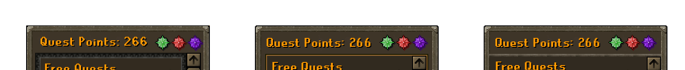
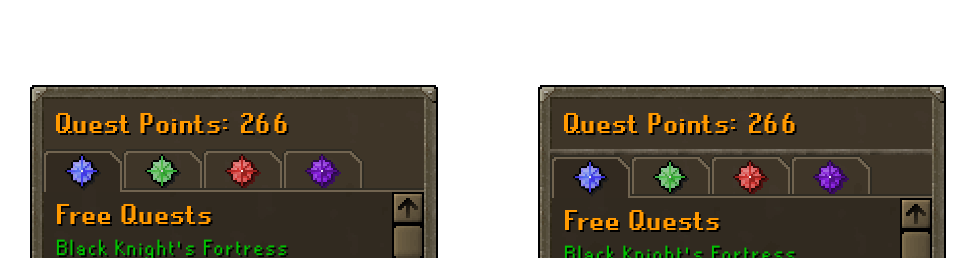
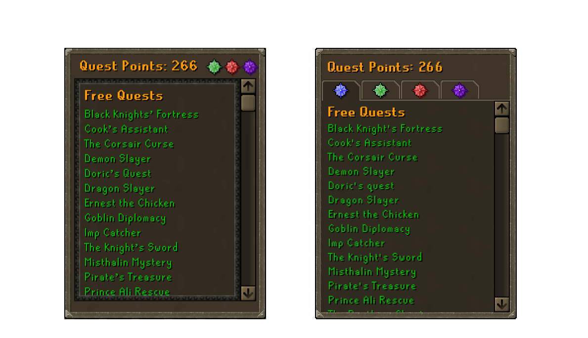
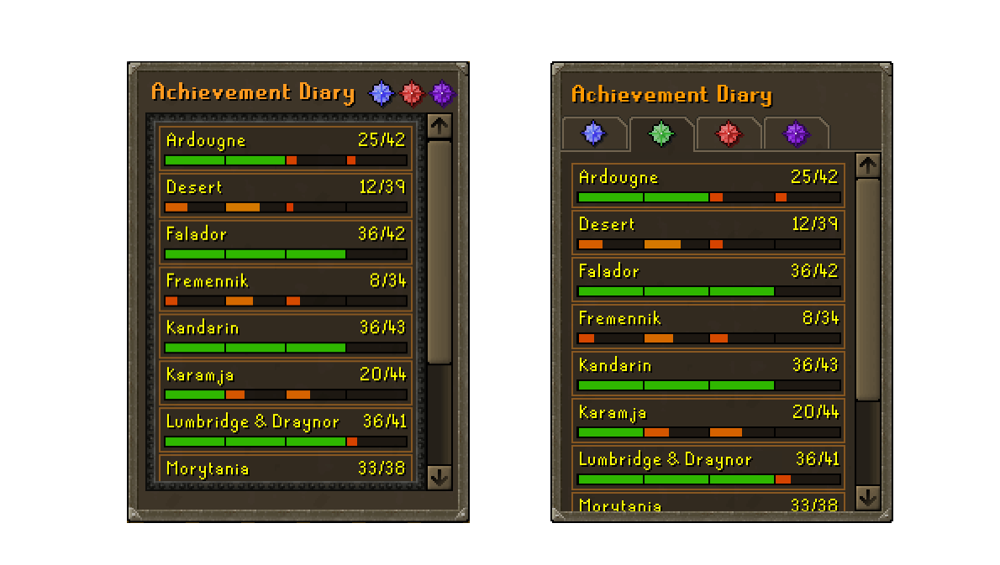
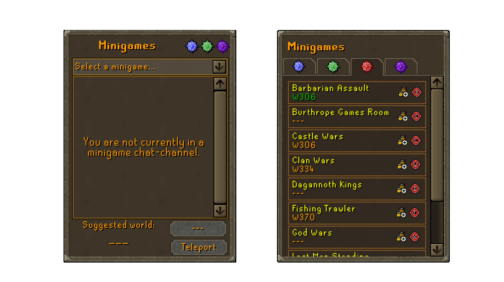
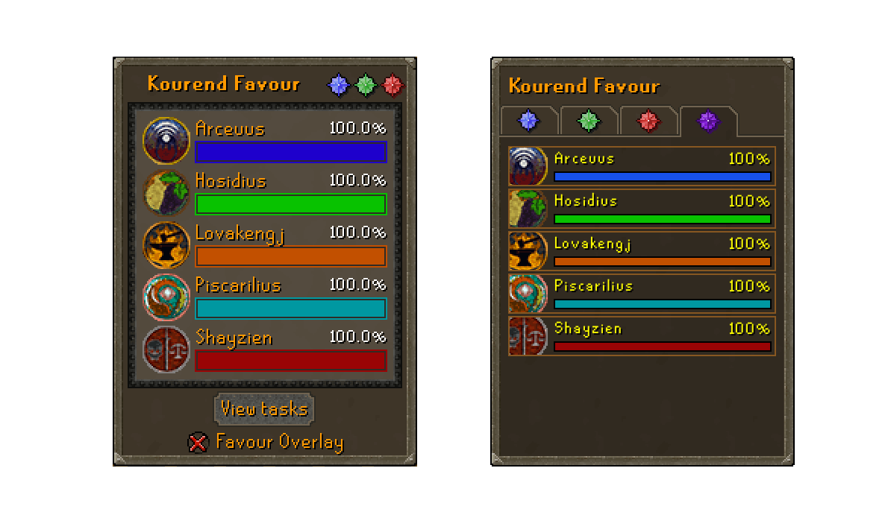

# Old School Runescape Interface Case Study

> Note: This is a live document.

As OldSchool Runescape (OSRS) grows bringing with it a new user base along with the numerous content updates. It is quickly becoming evident that the interfaces are falling behind interms of usability and function. OSRS has a userbase that is adamant about it's nostalgic appeal and as such, rarely deviates from the styles and overall design ethos.

This document discusses a number of interfaces, their usages and suggestions on how to improve them while maintaining the nostalgia which makes the game so successful.

Before we dive into the interfaces there are a number of things to note. 
1. The game client was designed in an era where users had smaller and lower resolution screens, as a result, a number of the interfaces have retained the pixel sizes from this time period. Any suggestions will retain this property -- interfaces will not be scaled, rather the heirarchies will be adapted to suit the functionality.
2. There is limited real-estate on screens. A balance must be struck on ensuring that the oldschool look and feel is captured when making decisions to update the interfaces.
3. The game is based on an old backup of the RuneScape MMO, specifically, it is from an era in which the game had just refreshed its `3XX` design version to its `4XX` iteration, and had begun work on the `5XX` iteration. These are most notably seen in the gameframes. For the purposes of this document. The various styles have been noted below.

    | `3XX` | `4XX` | `5XX` |
    | --- | --- | --- |
    |  | |

   This document builds on a mix of the `4XX`/`5XX` iterations, this variant is denoted `4/5XX`.

## Quest + more Panel

The quest panel is perhaps the most busy interface in the game second only to the settings interfaces. It contains the quest list as well as a number of sub-panels which provide frequently used information and functions.

**Panel header**

Before we proceed to the sub-interfaces themselves, lets take a look at the header of this interface. Below are three variants of the header, which largely keep the header the same but adjust the containers for the interfaces.

The first (left) is the current version. Note the large black border (which we'll now refer to as the `blackBorder`) and the scrollbar *outside* the container.

The second (middle) is a variation of the original which replaces the large `blackBorder` with a thinner border which is used in the `4/5XX` iteration. Additionally, the scrollbar is moved inside the container that is being scrolled.

The third (right) is a variation of the original which replaces the entire container with a divider.

**Panel Navigation**

The main issue with this interface is that it is incredibly confusing to determine which tab you are on -- as you navigate between sub-interfaces, the buttons change only in color. Below are the proposed changes based on the bank tabs interface (`bankTabs`).

The left variant simply replaces the header with the corresponding tabs underneath and opts to use the section below the tabs as the container. Approximately 10px on each side are added to the available realestate. This is the selected style for the header.

The right variant adds a visible divider between the header and the tabs. 

 

#### QUEST LIST

The quest panel contains, as the name suggests, the quests. The panel itself is fairly simple and does not have any glaring problems, but there is alot of room for improvement.

> Original (left), suggested (right)

**Issues**

1. The container itself, which comprises of the bordered content and the scrollbar have too much of a margin on the bottom. Notice how the bottom margin is about 3 times the size of the left and right margin?
2. The scroll bar is outside the panel. Traditionally, scrollbars indicate that the container they are within.

**Suggestions**
1. Move the content into a single container where it has more room to breathe.

#### ACHIEVEMENT DIARY

The achievement diary faces the same issues as the quest list; large `blackBorder`, scrollbar position, and spacing.

> Original (left), suggested (right)

**Issues**
1. Excluding the black border and the scroll bar issue, there is a double border appearing as a result of the border around the individual items in the list.

**Suggestions**
1. Move the content into a single container where it has more room to breathe.

#### MINIGAMES

This sub-interface has a large empty space in the center with a drop down. The drop-down is used to select the activity of interest and when it is selected you can view the members of the minigame's clan chat or teleport to the minigame.

> Original (left), suggested (right)

**Issues**
1. There is an extra click to navigate to the minigame of choice.
2. The clan chat interface is duplicated in the large container in the center. As a user, the clan chat should be primarily accessible via the clan-chat menu.
3. The placeholder `---` in the interfaces are not populated until the activity is show.

**Suggestions**
1. List all the minigames instead of using a dropdown.
2. Show suggested world under minigame name and indicate current world by the standard green color.
3. Show clan-chat join button which should enroll you into the clan-chat.
4. Show the teleport button for a one-click teleport cast.

#### KOUREND FAVOUR

This sub-interface is most disimillar to the other subinterfaces. The container, images and font-sizes are all inconsistent with the traditional sub-interface views.

> Original (left), suggested (right)

**Issues**
1. The fonts are all inconsitent in comparision to the above sub-interfaces.
2. The container has a white container which seems to have a transparency instead of the standard dark brown color.
3. The "View tasks" button replaces the traditional click-on-item-in-list paradigm.
4. The favour overlay is a convenience interface that only duplicates the content of this interface.

**Suggestions**
1. Use a consistent style for the items in the list.
2. Enable click-on-item-in-list functionality to open corresponding "House" guide.